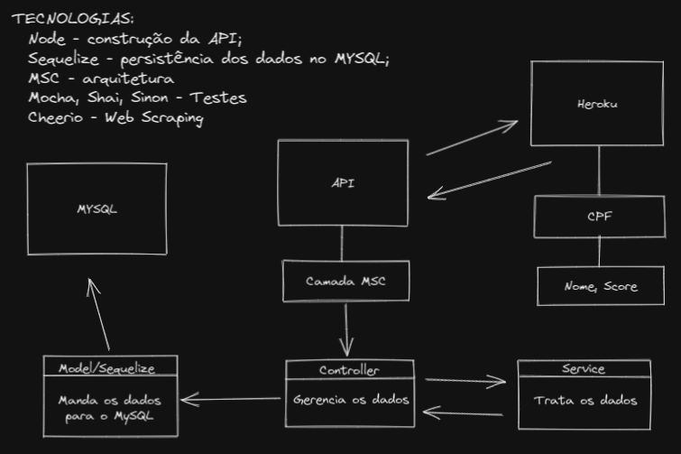

# Boas vindas ao repositório do projeto Web-Scraping-Node

Essa API tem o objetivo de capturar os dados (CPF, Nome e Score) do endereço https://sample-university-site.herokuapp.com/, tratar os dados e populá-los dinamicamente no MySQL.

# Habilidades

Nesse projeto, para persistencia no banco de dados foi construido um back-end usando `ORM` com o pacote `sequelize` do `npm`, e fui capaz de:

- Estruturar uma aplicação em camadas;
- Responsabilidades específicas para cada parte do app;
- Melhorar manutenibilidade e reusabilidade do seu código;
- Aplicar os padrões REST;
- Escrever assinaturas para APIs intuitivas e facilmente entendíveis.
- Criar e popular tabelas usando `models` do `sequelize`.
- Utilizar a biblioteca `Cheerio` para web scraping.

# Como usar essa aplicação:

- Primeiro você precisará ter o MySQL Server instalado e inicializado na sua máquina;
  - Linux: `sudo apt update && sudo apt install mysql-server`;
  - MacOS: `brew install mysql`;
  - Windows: `https://dev.mysql.com/downloads/mysql/`;
- Faça o clone do projto em sua maquina através dos endpoints ;
  - `SSH` git@github.com:douglas-santana/web-scraping-node.git;
  - `HTTP` https://github.com/douglas-santana/web-scraping-node.git;
- Instale as dependencias do projeto: `npm install`;
- Start a aplicação `npm start` que rodará na porta 5000;
- Consuma o endpoint para popular os dados no MySQL `http://localhost:5000/` e aguarde o retorno da mensagem `{ "message": "Dados inseridos no banco de dados MySQL" }`
se caso tudo ocorreu bem.
- **_Dica_**: Caso não tenha algum programa para fazer a requisição basta jogar o endereço `http://localhost:5000/` no browser do navegador e e aguarde o retorno
da mensagem `{ "message": "Dados inseridos no banco de dados MySQL" }`
se caso tudo ocorreu bem.
- Acesse o endpoint da API `https://sample-university-site.herokuapp.com/` e confira se os dados inseridos no banco de dados são os mesmos!

# Implementações futuras:
- Consumir todas as 4671 páginas da API `https://sample-university-site.herokuapp.com/` e populá-los no banco de dados;
- Testar a aplicação.

---
_Projeto feito com muito carinho por Douglas Nascimento Santana, linkedin: https://www.linkedin.com/in/douglasdns/_
